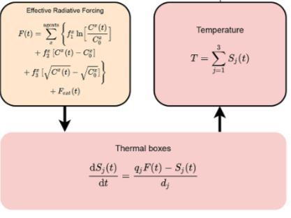

---
#
# By default, content added below the "---" mark will appear in the home page
# between the top bar and the list of recent posts.
# To change the home page layout, edit the _layouts/home.html file.
# See: https://jekyllrb.com/docs/themes/#overriding-theme-defaults
#
layout: page
title: Emulating the Effect of Climate Change with Deep Learning
---

## Introduction
[In the figure](#map-of-noresm-model-predictions) is the combined predictions of what the Earth's climate will look like based on the climate models present in CMIP6 (Coupled Model Intercomparison Project Phase 6). They gathered the results of 134 different climate models, each of which were built upon different assumptions, but all of whom use a large amount of computational resources to attempt to model the behaviour of Earth's climate in response to greenhouse gas emissions. The goal of these Earth System Models is to attempt to give as much information about the potential future of Earth's climate to policy makers in order for us as a collective to be able to make sustainable choices to prevent drastic climate changes. But with so many different possible scenarios, using these ESMs to model every single socioeconomic pathway is too computationally expensive and time consuming. With these three deep learning models, we hope to create climate emulators that are both accurate and inexpensive to run.

### Map of NorESM Model predictions

<select id="NorESM_Var_select" class=" hidden" onchange="changeModelNorESM()">
  <option value="NorESM_tas">Temperature</option>
  <option value="NorESM_dtr">Diurnal Temperature Range</option>
  <option value="NorESM_pr">Precipitation</option>
  <option value="NorESM_pr90">90th Percentile Precipitation</option>
</select>









## Data
The input data for our three machine learning models are from the Norwegian Earth System Model, which is generated from NorESM2 model and contains historical and future emission data. This generated dataset also is a part of the sixth coupled model intercomparison project. The data is multi-dimensional and set up in xarray table format, which includes emission data of CO2, SO2, CH4, and Black Carbon(BC) which ranges from 1850-2100.

<table>
    <thead>
        <tr>
            <th><strong>Input Variables</strong></th>
            <th><strong>Output Variables</strong></th>
        </tr>
    </thead>
    <tbody>
        <tr>
            <td>CO2</td>
            <td>Temperature</td>
        </tr>
        <tr>
            <td>SO2</td>
            <td>Daily Diurnal Temperature Range</td>
        </tr>
        <tr>
            <td>CH4</td>
            <td>Precipitation</td>
        </tr>
        <tr>
            <td>Black Carbon (BC)</td>
            <td>90th Percentile Precipitation</td>
        </tr>
    </tbody>
</table>

### Preprocessing for Deep Kernel Learning / Gaussian Process 
We can see from the cleaned data for the Deep Kernel Learning and Gaussian Process models, for CO2 and CH4 there is only 1 dimension, and for SO2 and BC has 5 dimensions. The reason for this is because SO2 and BC would only stay in the atmosphere for a few days to a week. While CH4 would stay in the atmosphere for years and millennia for CO2. This is why they have more dimensions, as they would be out of our atmosphere before they get mixed completely into our environment and have a global effect. Hence, the dimensions give us the distributions of SO2 and BC to account for where they are being emitted. We do this in order to maintain the spatial and temporal variability of the emissions which otherwise could be lost due to the high dimensionality of the data and Gaussian Process's inability to handle high dimensional data.

## Models

### Deep Kernel Learning
Deep Kernel Learning first introduced in [Deep Kernel Learning](https://arxiv.org/abs/1511.02222v1) is a hybrid model using the expressiveness of a Neural Network and combining it with the probabilistic modeling of a Gaussian Process. This is done by using the Neural Network to learn the parameters of the kernel function of the Gaussian Process, which is possible due to neural networks abiltiy to learn complex non-linear functions. Which improves the predictive performance of the Gaussian Process.

**Here is a graphical depiction of a  Deep Kernel Learning Model**

  <object type="image/svg+xml" data="assets/svgs/graph.svg" width="800" height="800">Your browser does not support SVG</object>

Looking at the figure, we first have the input data, X, which then goes through hidden layers, which in the neural network portion of the hybrid model. In this process, the neural network basically learns a representation and underlying patterns of the data. Which is then fed into the parametric layer, kernelizing the neural networks representation to be used in the Gaussian Process, which using the learned representation, learns the underlying distribution of the training data. This is then used to make predictions on the test data. 

For building the mode, we initializing the kernels, following the approach outlined in [Climate Bench V1.0](https://agupubs.onlinelibrary.wiley.com/doi/full/10.1029/2021MS002954), we assgined a distinct kernel for each input dimension to guide the Deep Neural Network towards more favorable outcomes and preventing the model from converging to suboptimal minima. Next, we then perform a grid search to choose the best hyperparameters for the model, comparing the [NRMSE](#evaluation-metric) scores for each combination of hyperparameters. The best hyperparameters are then used to train the final model. 

> For more information on the training process, please refer to the training section in the [appendix](/appendix.md).

### XGBoost
The XGBoost technique stands for "Extreme Gradient Boosting" and is a scalable tree-boosting system. It has became popular in these years since it has won many Kaggle competitions with higher accuracy and higher efficiency. XGBoost integrates the predictions from multiple decision trees like Random Forest, but it combines multiple machine learning algorithms to boost the decision trees, such as gradient descent, linear regression with regularization, and "exact greedy algorithms". We can say it's like a stronger version of Random Forest The model predict the final results by weighted sum of predictions of all decision trees. Unlike Random Forest, the boosting porcess minimizes the bias and reduce the overfitting.

### PINN
One of the best performing deep learning models for many tasks is the Neural Network, for our case, the Convolutional Neural Network. While it has been traditionally used for image recognition tasks, by slicing the data into images of aerosol distribution over time, a basic CNN architechture was created by Professor Duncan Watson Parris that emulated Earth's climate pretty accurately. To improve upon it and to increase explanability of how the model functions, our Physics informed neural network incorporates physical constraints brought on by known physical equations. Currently, there is no one known set of equations that is used to model the relationbetween the aerosols being released and the temperature and precipitation, but previous work done on Finite amplitude Impulse Response (FaIR) models (Leach et al. 2021) have proposed a set of ordinary differential equations that they have proven to be adequate in modeling the relation between emissions of greenhouse gases and mean climate response. By incorporating these equations into the existing loss function of the original CNN architecture outlined in ClimateBench, the resulting PINN will produce results that are more robust and physically constrained. The process of how a PINN is built is pictured below.

    

The first step is to take an existing neural network architechture before incorporating the physical differential eqautions in as a seperate loss value that is added on top of the original mean squared error. The differential equation used for this PINN in particular is as follows from FaIRv2.0.

    

## Results
Below are the predictions made by our models between the years 2015-2100. And are displayed in the interactive maps below which depict the predictions of the models ranging from the original models of the Gaussian Process, CNN and Random Forest that we built during our reproduction of the original [Climate Bench](https://agupubs.onlinelibrary.wiley.com/doi/full/10.1029/2021MS002954) paper, to the new models of Deep Kernel Learning, XGBoost and PINN. The predictions are for the average surface temperature, diurnal temperature range, precipitation, and 90th percentile precipitation. 

### Interactive Map of Model Predictions

<select id="models_select" class="hidden" onchange="changeModel()">
  <option value="CNN">CNN</option>
  <option value="PINN">PINN</option>
  <option value="RF">Random Forest</option>
  <option value="XG">XGBoost</option>
  <option value="GP">Gaussian Process</option>
  <option value="DKL">Deep Kernel Learning</option>
</select>
<select id="variable_select" class="hidden" onchange="changeModel()">
  <option value="tas">Average Surface Temperature</option>
  <option value="dtr">Diurnal Temperature Range</option>
  <option value="pr">Precipitation</option>
  <option value="pr90">90th Percentile Precipitation</option>
</select>

















































### Evaluation Metric
Displayed are the results of the models using evaluation metrics that describe the spatial variability and the global variability of the predictions to more accurately compare the models.

$$
\begin{equation}
    NRMSE_s = \sqrt{\langle(|x_{i, j, t}|_t - |y_{i, j, t, n}|_{n, t})^2\rangle}/|\langle y_{i, j}\rangle|_{t, n}
\end{equation}
$$

$$
\begin{equation}
    NRMSE_g = \sqrt{|(\langle x_{i, j, t}\rangle - \langle|y_{i, j, t, n}|_n\rangle)^2|_t} / |\langle y_{i, j} \rangle|_{t, n}
\end{equation}
$$

$$
\begin{equation}
    NRMSE_t = NRMSE_s + \alpha \times NRMSE_g
\end{equation}
$$

The NRMSE (Normalized Root Mean Square Error) is a measure of the error between the predicted and actual values, but in this case, they are modified to account for the spatial and global variability of the predictions. $$NRMSE_s$$ is the normalize global mean root-mean square error, and $$NRMSE_g$$ is $$NRMSE$$ in the global mean. The equations also includes a weighing function to take the decreasing grid-cell area towards the north and south poles which is defined as follows,

$$
\begin{equation}
    \langle x_{i, j} \rangle = \frac{1}{N_{lat}N_{lon}}\sum_i^{N_{lat}}\sum_i^{N_{lon}} \cos(lat(i))x_{i, j}
\end{equation}
$$

and the co-efficient $$\alpha$$ is chosen to be 5 from the [ClimateBench](https://agupubs.onlinelibrary.wiley.com/doi/full/10.1029/2021MS002954) paper, in order to provide equal weightage between the measure.

The reason, we are using these eveluation metric is to be able to compare directly the performances for our models against the models from the paper. And using the same evalutation metric will give us the most 1-1 comparison.

### Tables of Results
##### Gaussian Process vs. Gaussian Process with Deep Kernel Learning

<table>
    <thead>
        <tr>
            <th>Model</th>
            <th colspan="3">Deep Kernel Learning</th>
            <th colspan="3">GP from Reproduction</th>
            <th colspan="3">Difference</th>
        </tr>
        <tr>
            <th>Variable</th>
            <th>Global</th>
            <th>Spatial</th>
            <th>Total</th>
            <th>Global</th>
            <th>Spatial</th>
            <th>Total</th>
            <th>Global</th>
            <th>Spatial</th>
            <th>Total</th>
        </tr>
    </thead>
    <tbody>
        <tr>
            <td>TAS</td>
            <td>0.0458</td>
            <td>0.0752</td>
            <td><strong>0.3044</strong></td>
            <td>0.0437</td>
            <td>0.0906</td>
            <td>0.3089</td>
            <td>0.0021</td>
            <td>-0.0154</td>
            <td>-0.0045</td>
        </tr>
        <tr>
            <td>DTR</td>
            <td>1.5602</td>
            <td>8.4860</td>
            <td><strong>16.2872</strong></td>
            <td>2.6495</td>
            <td>9.1950</td>
            <td>22.4425</td>
            <td>-1.0893</td>
            <td>-0.7090</td>
            <td>-6.1553</td>
        </tr>
        <tr>
            <td>PR</td>
            <td>0.3169</td>
            <td>2.4195</td>
            <td><strong>4.0041</strong></td>
            <td>0.3784</td>
            <td>2.3301</td>
            <td>4.2223</td>
            <td>-0.0615</td>
            <td>0.0894</td>
            <td>-0.2182</td>
        </tr>
        <tr>
            <td>PR90</td>
            <td>0.4133</td>
            <td>2.4919</td>
            <td><strong>4.5582</strong></td>
            <td>0.3955</td>
            <td>2.6048</td>
            <td>4.5821</td>
            <td>0.0178</td>
            <td>-0.1129</td>
            <td>-0.0239</td>
        </tr>
    </tbody>
</table>

##### Convoluted Neural Networks vs. Physics Informed Neural Network

<table>
    <thead>
        <tr>
            <th>Model</th>
            <th colspan="3">PINN</th>
            <th colspan="3">CNN from Reproduction</th>
            <th colspan="3">Difference</th>
        </tr>
        <tr>
            <th>Variable</th>
            <th>Global</th>
            <th>Spatial</th>
            <th>Total</th>
            <th>Global</th>
            <th>Spatial</th>
            <th>Total</th>
            <th>Global</th>
            <th>Spatial</th>
            <th>Total</th>
        </tr>
    </thead>
    <tbody>
        <tr>
            <td>TAS</td>
            <td>0.0428</td>
            <td>0.1021</td>
            <td><strong>0.3164</strong></td>
            <td>0.0440</td>
            <td>0.0966</td>
            <td>0.3167</td>
            <td>-0.0012</td>
            <td>0.0055</td>
            <td>-0.0003</td>
        </tr>
        <tr>
            <td>DTR</td>
            <td>0.9371</td>
            <td>8.3310</td>
            <td><strong>13.016</strong>6</td>
            <td>1.2263</td>
            <td>8.4313</td>
            <td>14.5632</td>
            <td>-0.2892</td>
            <td>-0.1003</td>
            <td>-1.5466</td>
        </tr>
        <tr>
            <td>PR</td>
            <td>0.1998</td>
            <td>2.1588</td>
            <td>3.1582</td>
            <td>0.1776</td>
            <td>2.2642</td>
            <td><strong>3.1526</strong></td>
            <td>0.0222</td>
            <td>-0.1054</td>
            <td>0.0056</td>
        </tr>
        <tr>
            <td>PR90</td>
            <td>0.3159</td>
            <td>2.7057</td>
            <td><strong>4.2857</strong></td>
            <td>0.3726</td>
            <td>2.5163</td>
            <td>4.3796</td>
            <td>-0.0567</td>
            <td>0.1894</td>
            <td>-0.0939</td>
        </tr>
    </tbody>
</table>

##### Random Forest vs. XGBoost

<table>
    <thead>
        <tr>
            <th>Model</th>
            <th colspan="3">XGBoost</th>
            <th colspan="3">Random Forest from Reproduction</th>
            <th colspan="3">Difference</th>
        </tr>
        <tr>
            <th>Variable</th>
            <th>Global</th>
            <th>Spatial</th>
            <th>Total</th>
            <th>Global</th>
            <th>Spatial</th>
            <th>Total</th>
            <th>Global</th>
            <th>Spatial</th>
            <th>Total</th>
        </tr>
    </thead>
    <tbody>
        <tr>
            <td>TAS</td>
            <td>0.1367</td>
            <td>0.2273</td>
            <td><strong>0.9107</strong></td>
            <td>0.3979</td>
            <td>0.4525</td>
            <td>2.4419</td>
            <td>-0.3044</td>
            <td>-0.2746</td>
            <td>-1.7965</td>
        </tr>
        <tr>
            <td>DTR</td>
            <td>2.8948</td>
            <td>10.5215</td>
            <td><strong>24.9953</strong></td>
            <td>2.7712</td>
            <td>13.1610</td>
            <td>27.0172</td>
            <td>0.1213</td>
            <td>-1.9044</td>
            <td>-1.2981</td>
        </tr>
        <tr>
            <td>PR</td>
            <td>0.3851</td>
            <td>4.0115</td>
            <td><strong>5.9368</strong></td>
            <td>0.9235</td>
            <td>5.5991</td>
            <td>10.2167</td>
            <td>-0.5828</td>
            <td>-2.2157</td>
            <td>-5.1300</td>
        </tr>
        <tr>
            <td>PR90</td>
            <td>0.3745</td>
            <td>4.7913</td>
            <td><strong>6.6639</strong></td>
            <td>0.9955</td>
            <td>6.7342</td>
            <td>11.7122</td>
            <td>-0.4744</td>
            <td>-0.8491</td>
            <td>-3.2214</td>
        </tr>
    </tbody>
</table>

## Conclusion
Looking at the results we can see that each model outperformed their counterpart for every variable. However, as we can see the improvement from the PINN models against the CNN are rather negligible due to the small difference in the NRMSE scores. Among all the models, the PINN does have the best scores overall outperforming all the other models with respect to the NRMSE scores. However, all models performed extremely well overall and were all able to capture the spatial variance well and indeed could be used to emulate the climate to a acceptable degree. To use such predictions however for policymakers and climate science, further improvement is still required to fully capture the spatial and temporal variability of the our complex climate system. 

On the other hand however, policymakers and the general public can assess which emission pathway is most suitable for achieving the goal of reducing global warming. There are still various techniques and algorithms of Deep Learning models are waiting for people to explore and research. Allowing
people to learn which emission path is most suitable for reducing the effect of climate change, and create a better environment for all.

## Further Work
#### Deep Kernel Learning

Further exploation in a similar direction to Deep Kernel Learning would be to explore implementing a Neural Process(NPs) for climate data. Neural Processes combine the capabilities of Neural Networks and Gaussian Processes, using a unique framework that leverages context points—input-output pairs—to model and fit target data, diverging from traditional Deep Kernel Learning methods.

Another avenue one could explore is to leverage GPytorch for implementing Exact Deep Kernel Learning, as demonstrated in GPytorch's documentation with the example of EXACT DKL using KISS-GP. I had attempt to implement my Deep Kernel Learning in GPytorch, but I encountered challenges with high-dimensional outputs, indicating the complexity and potential hurdles in these sophisticated modeling techniques.

#### XGBoost

The XGBoost technique can surpass the baseline model from ClimateBench. This paper proves that XGBoost is scalable for predicting a large and complex dataset like climate data. According to "XGBoost-based method for flash flood risk assessment", the XGBoost also proves its capability when it comes to predicting regional climate data. The higher accuracy rates of XGBoost have made this model popular in recent years. We believe that XGBoost has huge potential in the field of climate science for predicting other climate variables like humidity, snow, and wind. However, there is still space for improving the efficiency of XGBoost for large and complex datasets. For future work, we believe that we can dive deeper to improve the efficiency of XGBoost for complex datasets with multi-dimensions.

#### PINN

While our work with the PINN ultimately ended up with little improvement to the baseline CNN dictated in ClimateBench, there are still many other ways in which physical laws and constraints could be used to better improve a neural network approach to climate emulation. For our approach specifically, we incorporated the constants and equations set by FaIRv2.0, however we were comparing our results to the results of the NorESM2 model, which FaIR had not calculated constants for in their paper. For our physical equations constants then, we used a simple average of all the constants that FaIR had calculated. If instead we could replicate FaIR's methodology to find constants specifically for the NorESM2 model, the PINN could theoretically do better. Besides that, looking for other differential equations that better show the relationship between precipitation and temperature with greenhouse gas emissions would also result in a better PINN.

## References
- [ClimateBench](https://agupubs.onlinelibrary.wiley.com/doi/full/10.1029/2021MS002954)
- [Deep Kernel Learning](https://arxiv.org/abs/1511.02222v1)
- [XGBoost-based method for flash flood risk assessment](https://www.sciencedirect.com/science/article/pii/S0022169421004297)
- [FaIRv2.0](https://gmd.copernicus.org/articles/14/3007/2021/)
- [XGBoost: A Scalable Tree Boosting System](http://dx.doi.org/10.1145/2939672.2939785)
- [A Visual Exploration of Gaussian Processes](https://distill.pub/2019/visual-exploration-gaussian-processes/)
- [GPytorch](https://gpytorch.ai/)
- [Neural Processes](https://arxiv.org/abs/1807.01622)
- [Gaussian processes for machine learning](http://www.gaussianprocess.org/gpml/chapters/RW.pdf)
- [{GP}flow: A {G}aussian process library using {T}ensor{F}low](http://jmlr.org/papers/v18/16-537.html)
- [A Framework for Interdomain and Multioutput {G}aussian Processes](https://arxiv.org/abs/2003.01115)
- [GPFlow](https://gpflow.github.io/GPflow/2.9.1/index.html)
- [Tune: A Research Platform for Distributed Model Selection and Training](https://arxiv.org/pdf/1807.05118.pdf)
- [GPyTorch: Blackbox Matrix-Matrix Gaussian Process Inference with GPU Acceleration](https://arxiv.org/abs/1809.11165)

## Appendix
> [link to appendix](/DSC180B-website/appendix/)
